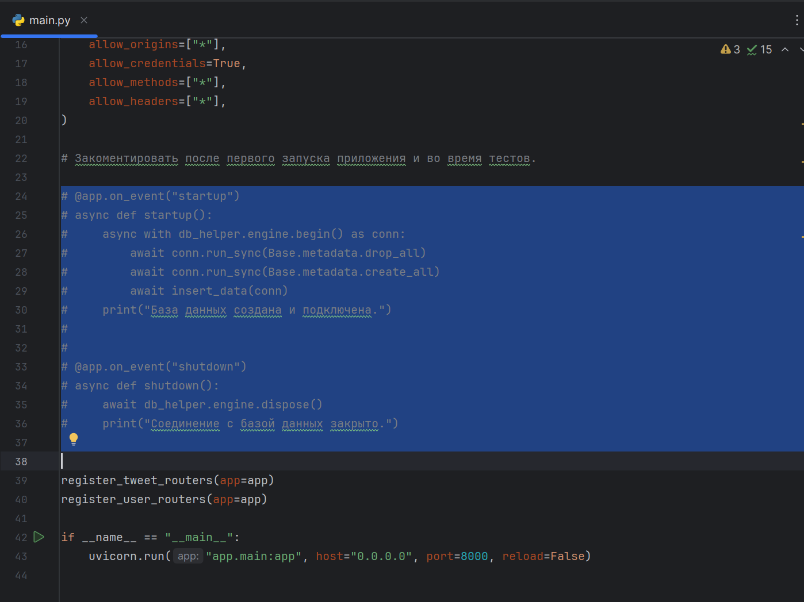
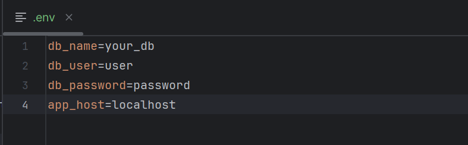
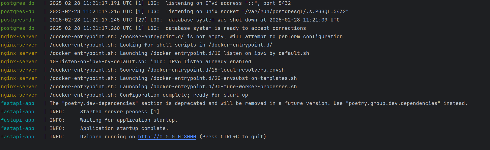
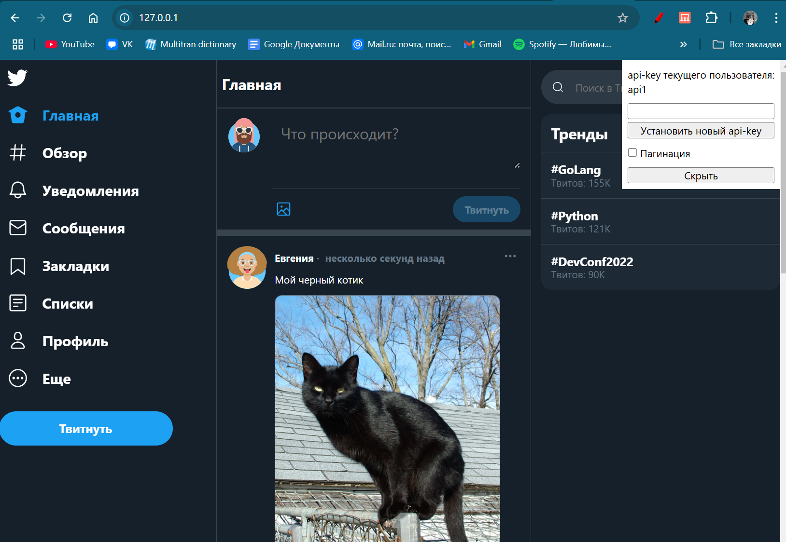
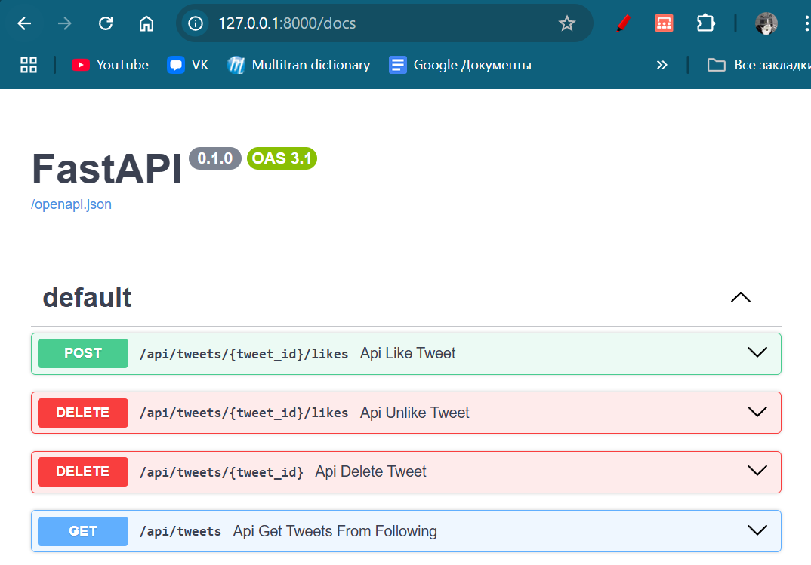

# Сервис микроблогов

Проект представляет из себя бэкенд
корпоративной сети микроблогов. Поскольку это корпоративная сеть пользователи создаются
в другом сервисе, но в этой сети они идентифицируются с помощью api-key, которе передается в 
заголовке запроса.

### Сервис умеет:

1. Пользователь может добавить новый твит.
2. Пользователь может удалить свой твит.
3. Пользователь может зафоловить другого пользователя.
4. Пользователь может отписаться от другого пользователя.
5. Пользователь может отмечать твит как понравившийся.
6. Пользователь может убрать отметку «Нравится».
7. Пользователь может получить ленту из твитов отсортированных в
порядке убывания по популярности от пользователей, которых он
фоловит.
8. Твит может содержать картинку.


### Используемые инструменты

* Python (3.12);
* Poetry (управление зависимостями и сборка пакетов)
* FastApi (асинхронный веб-фрэймворк);
* Docker and Docker Compose (контейнеризация);
* PostgreSQL (СУБД);
* SQLAlchemy (управление базами данных для Python);
* Pydantic (верификация данных);
* Pytest (тесты);
* Uvicorn (веб-сервер)
* Nginx (связующий сервер между FastAPI приложением и статическими данными - фронтендом).


### Сборка и запуск приложения

Подразумевается что у вас уже установлен [Python](https://www.python.org/downloads/) 
и [Docker](https://www.docker.com/products/docker-desktop/)

1. Сначала нужно сделать пул проекта из gitlab.

```
git clone https://gitlab.skillbox.ru/anastasiia_pushkareva/python_advanced_diploma.git
```

2. Поскольку управление зависимостями осуществляет Poetry, 
необходимо установить его активировать среду.

```
pipx install poetry

poetry install --no-root
```

3. Перед первой сборкой контейнеров разкоментируйте строки:



При последующих запусках приложения их нужно закоментировать, 
иначе все данные в базе данных перезапишутся. 

Задайте свои переменные.



Затем запустите docker compose.

```
docker compose -f docker-compose.yml build

docker compose -f docker-compose.yml up
```




Приложение запущено и доступно по адресу предоставленному провайдером если 
вы запускаете на удаленном сервере.




Документация доступна по адресу http://<your_domain>:8000/docs/



### Для тестирования:
1. Для тестирования нужно запустить другой контейнер с тестовой базой данных.

```
docker compose -f docker-compose.dev.yml up -d
```

2. Запустите тесты.

```
poetry run pytest
```

